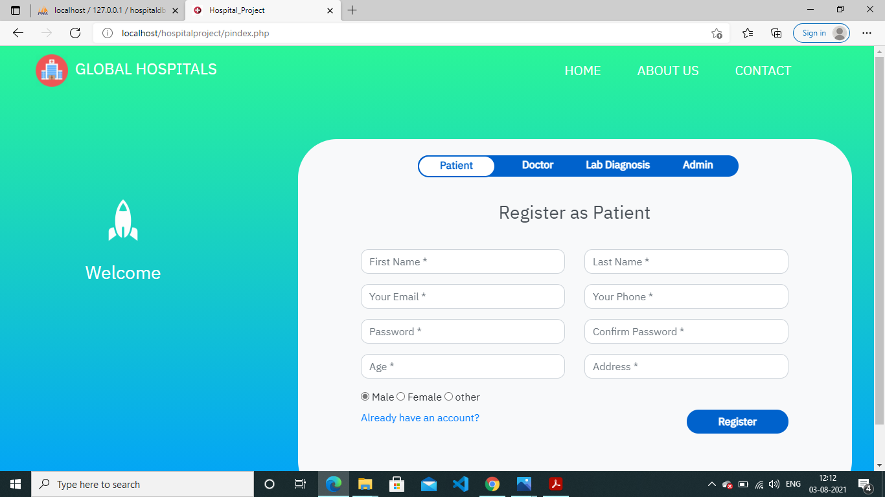
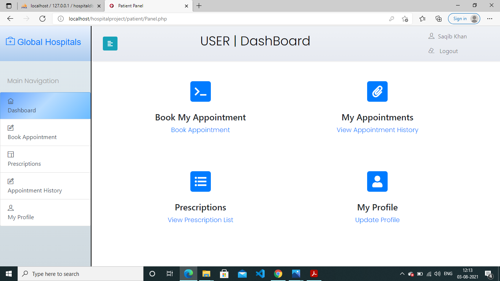
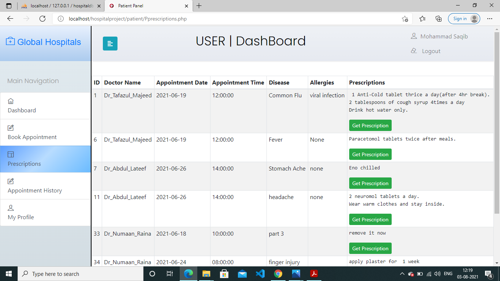
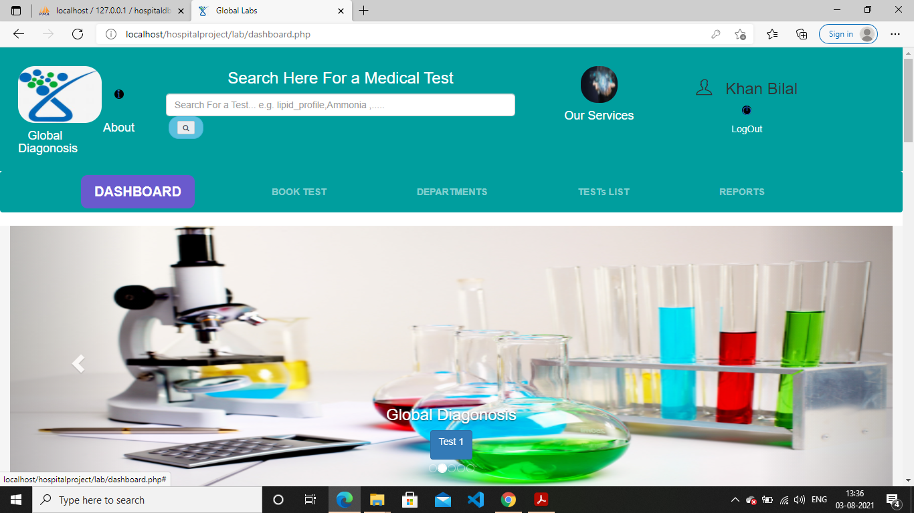
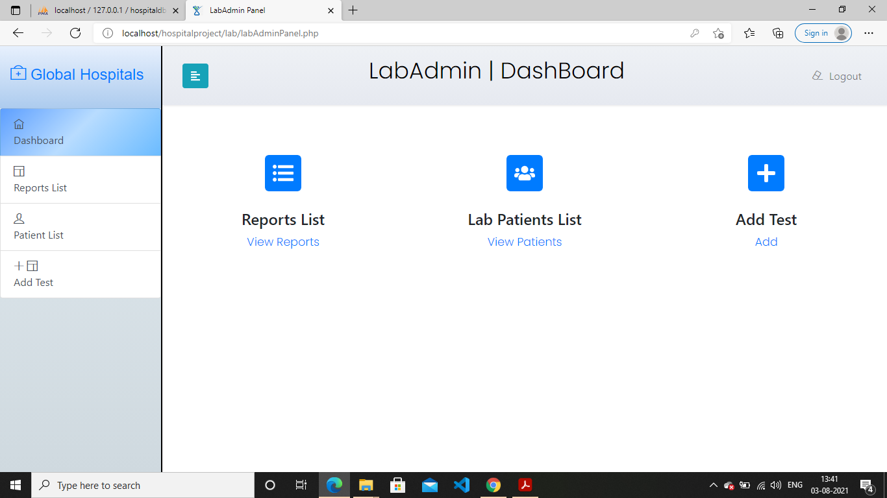
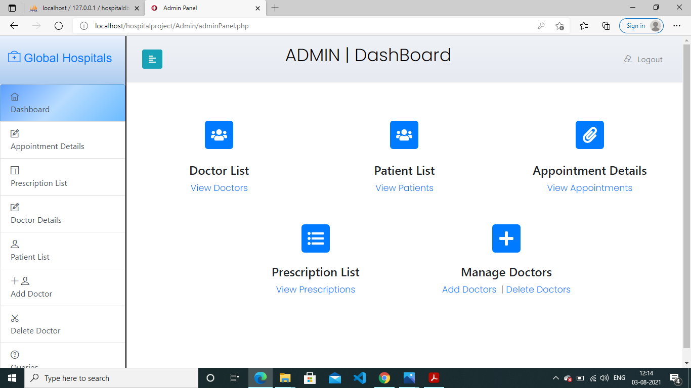

<h2> How to test this project</h2>

1. create database = 'hospitaldb' in mysql using xampp software
2. import hospitaldb.sql

Admin credentials -
username = projectAdmin
password= projectAdmin123

 labAdmin Credentials

username=labAdmin
password =labAdmin123

After extracting the 'hospitalproject' folder in c://xampp/htdocs
Access the index page of hms in any browser using link 'localhost/hospitalproject/index.php' 

<h2>Some Project Screenshots</h2>

